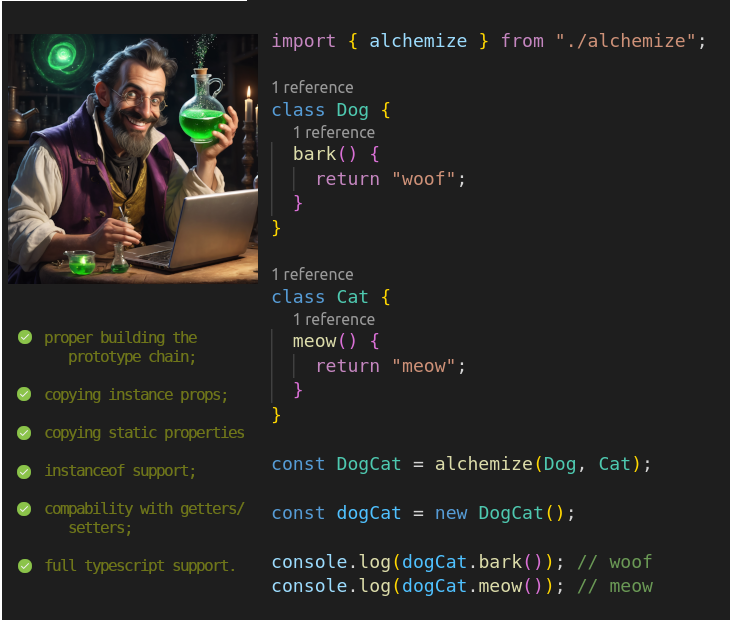

# Alchemist

Alchemist is a fast, lightweight, zero-dependency ts/js package designed to restore the rightful throne to the most powerful and elegant aspect of OOP: multiple inheritance.

<h3>Installation</h3>
npm i @lenka/alchemist
<h3>Using<h3>
<h4>Typescript:</h4>
import { alchemize } from '@lenka/alchemist';

alchemize(SomeClass, AnotherClass, OneMoreClass);

<h4>As ES6 module:</h4>
import { alchemize } from '@lenka/alchemist';

alchemize(SomeClass, , AnotherClass, OneMoreClass);

<h4>As CommonJS module:</h4>
const { alchemize } = require('@lenka/alchemist');

alchemize(SomeClass, , AnotherClass, OneMoreClass);
